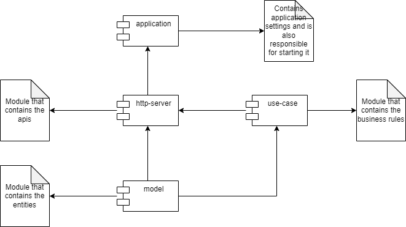

# Simple Clean Architecture example project

## Component diagram


## Technologies
* Kotlin
* Spring boot web
* Spring boot actuator
* Spring boot test
* Maven multi modules
* Logback
* Kotest
* Regex
* Java 16

## Installation
Before installing it is necessary to verify that you have the variables below configured:
* **M2_HOME**
* **JAVA_HOME**

To install and generate the final artifact, you must:
* Clone this repository
* Run command in project root from terminal:
  * ```./mvnw clean install```

## Execution
Run the command below in the folder: **ROOT_PROJECT/target** 
* ```java -jar simple-clean-architecture-example.jar```
  * The application runs on port 9090, make sure it is not in use at the time of execution

## Validation
Run command from terminal:
* ```curl --location --request GET 'http://localhost:9090/actuator/health'```
  * Make sure you have curl installed, if you are using Windows you can use GitBash for example

If everything is ok then you should get the following response:
  * ```{"status":"UP"}```


## Requests examples
Here are some examples of requests:
* ```curl --location --request POST 'http://localhost:9090/password/validate' --header 'Content-Type: application/json' --data-raw '{"password": "ABbvq12354!@#$"}'```
* ```curl --location --request POST 'http://localhost:9090/password/validate' --header 'Content-Type: application/json' --data-raw '{"password": "TESTANDO-APLICACAO"}'```
* ```curl --location --request POST 'http://localhost:9090/password/validate' --header 'Content-Type: application/json' --data-raw '{"password": "Tes@235@#Lo"}'```

## Comments
* Project has few patterns the focus was **clean architecture** with maven modules
* Application port was left as the default 9090 to facilitate the examples of requests, in production it is not recommended to leave it fixed in the application
* For better management of the tool in production it is recommended to use some APM tool
* Any running problems, please let me know for review
* Feel free to evaluate the project and send some PR if you want